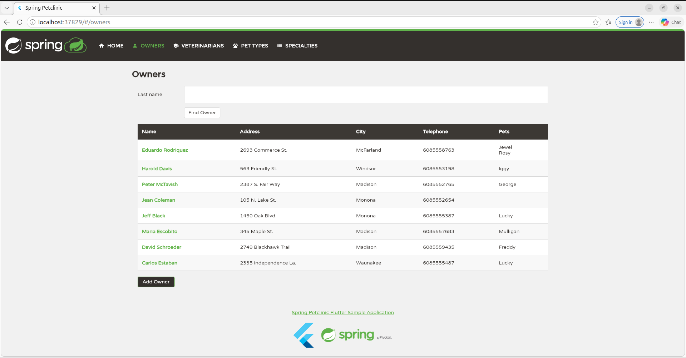
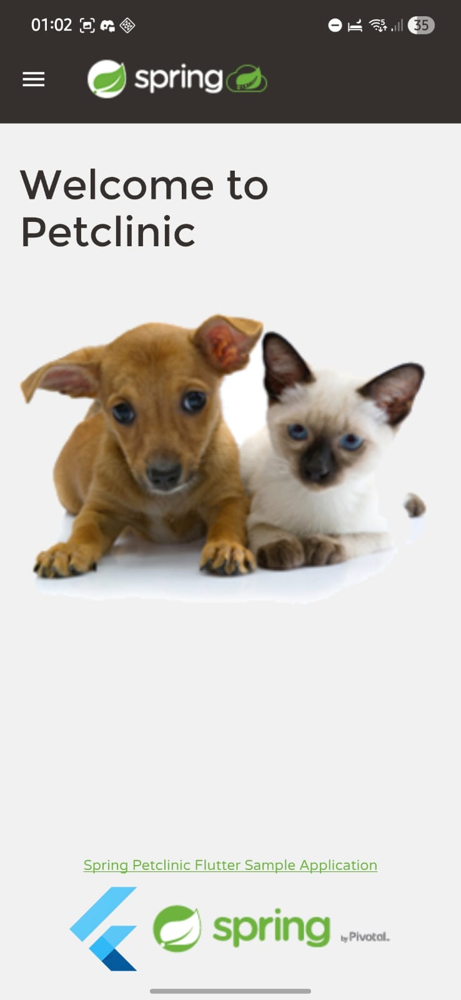
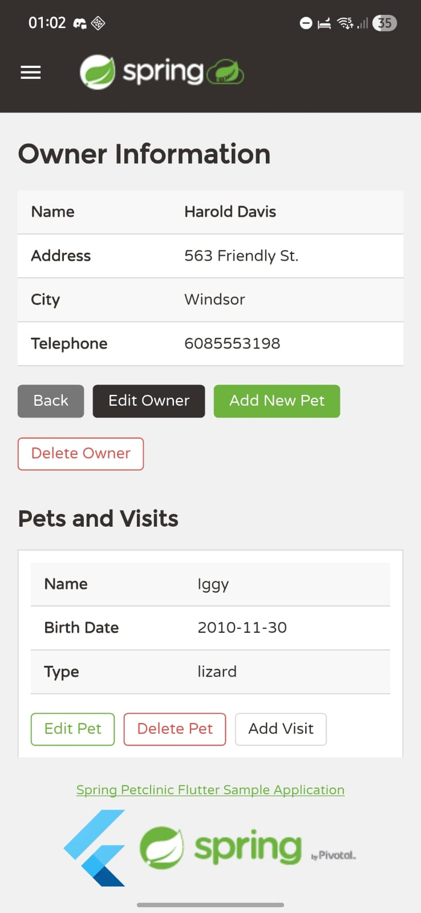

# Spring Petclinic Flutter

[](https://github.com/San-43/spring-petclinic-flutter/actions/workflows/dart.yml)

Flutter frontend for Spring Petclinic. This app targets Android and web, mirrors
the functional flows of the Angular frontend, and uses the same REST backend exposed by
`spring-petclinic-rest`.

## Screenshots

### Web

<p align="center">
  
</p>

### Android

<p align="center">
  
  
</p>

## Backend

Start the backend first:

```bash
cd ~/spring-petclinic-rest
./mvnw spring-boot:run
```

The expected API is:

```text
http://localhost:9966/petclinic/api
```

## API configuration

The app resolves the API base URL in this order:

1. `PETCLINIC_API_BASE_URL` passed with `--dart-define`
2. Platform default

Platform defaults:

- Android emulator: `http://10.0.2.2:9966/petclinic/api`
- Web: `http://localhost:9966/petclinic/api`
- Other non-Android platforms: `http://localhost:9966/petclinic/api`

That logic lives in:

```text
lib/shared/config/api_config.dart
```

Override it at runtime when needed:

```bash
flutter run --dart-define=PETCLINIC_API_BASE_URL=http://<host>:9966/petclinic/api
```

Use an explicit override when:

- running on a physical Android device;
- serving the web app against a backend that is not on `localhost`;
- pointing the app to a shared/staging backend.

## Run on Android

For an Android emulator:

```bash
cd ~/spring-petclinic-flutter
flutter pub get
flutter run
```

For a physical Android device, pass the host machine IP explicitly:

```bash
flutter run --dart-define=PETCLINIC_API_BASE_URL=http://<host>:9966/petclinic/api
```

## Run on Web

For local browser development against the backend running on the same machine:

```bash
cd ~/spring-petclinic-flutter
flutter pub get
flutter run -d chrome
```

If the backend is not reachable at `http://localhost:9966/petclinic/api`, pass an override:

```bash
flutter run -d chrome --dart-define=PETCLINIC_API_BASE_URL=http://<host>:9966/petclinic/api
```

## Build

Build an Android debug APK:

```bash
flutter build apk --debug
```

Build the web app:

```bash
flutter build web
```

## Validation

Typical checks:

```bash
flutter analyze
flutter test
flutter build apk --debug
flutter build web
```

## Contributing

The [issue tracker](https://github.com/San-43/spring-petclinic-flutter/issues) is the preferred channel for bug reports, feature requests, and submitting pull requests.

For pull requests, please keep the existing Flutter and Dart code style and make sure the validation commands listed above pass before submitting changes.
